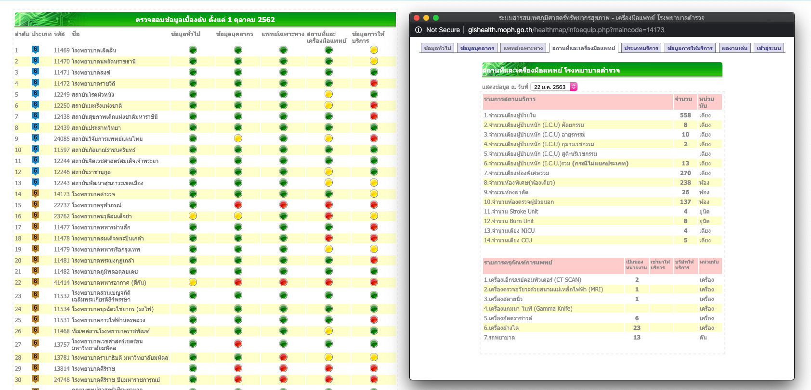
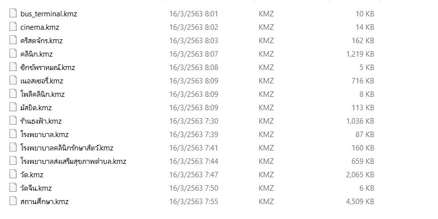

> อัพเดท 2020-03-24 01:59:33

# datasets ข้อมูล

Dataset และ API ที่พร้อมใช้งานสำหรับสถานการณ์ COVID-19 ของประเทศ

> สนใจแชร์ API, database, datasets หรือต้องการจะ opensource โค้ด ที่เป็นประโยชน์ต่อสถานการณ์สามารถติดต่อผมได้ tcdg@nutchanon.org

## ข้อมูลสถานะการณ์การแพร่ระบาด

### data.go.th
รายงานผู้ป่วยยืนยันประจำวัน จาก กรมควบคุมโรค

#### Download/เข้าถึงจาก
[csv](https://data.go.th/dataset/covid-19-daily) | [API](https://data.go.th/dataset/covid-19-daily)

### TH-STAT

ข้อมูลทางสถิติอนุกรมเวลาของจำนวนผู้ติดเชื้อ

 * **แหล่งข้อมูล**: <https://covid19.th-stat.com/>
 * **อัพเดทล่าสุด**: 2020-03-24 01:59:11
 * **การดูแล**: ดาวนโหลด `csv` จากแหล่งข้อมูลลงใน `~/Downloads` จากนั้น รัน `make datasets/thstat.csv`

| Column                    | ชนิด  | ตัวอย่าง     | หมายเหตุ                                 |
| ------------------------- | ----- | ------------ | ---------------------------------------- |
| Date                      | `str` | "2020-01-05" | วันที่                                   |
| CumCase                   | `int` | 14           | ยอดสะสมผู้ติดเชื้อตั้งแต่วันที่ 01-01-20 |
| CurrentlyInfectedPatients | `int` | 104          | จำนวนผู้รับการรักษา                      |
| Recovered                 | `int` | 9            | จำนวนผู้ที่หายแล้ว                       |
| Deaths                    | `int` | 1            | จำนวนผู้เสียชีวิต                        |

#### Download/เข้าถึงจาก
[csv](datasets/thstat.csv) | [excel](datasets/thstat.xlsx) | [json](datasets/thstat.json)

### 5Lab's CovidTracker
ข้อมูลเกี่ยวกับเคสต่างๆ
 * **แหล่งข้อมูล**: <https://covidtracker.5lab.co/>
 * **อัพเดทล่าสุด**: ทุกชั่วโมง
 * **การดูแล**: merge PR

| Column        | ชนิด  | ตัวอย่าง                                                 | หมายเหตุ      |
| ------------- | ----- | -------------------------------------------------------- | ------------- |
| Status        | `str` | "confirmed"                                              | กลุ่มข้อมูล   |
| Date          | `str` | "2020-01-22 17:30"                                       | วันเวลาของเคส |
| Placename     | `str` | "สถาบันบำราศนราดูร"                                      | สถานที่ของเคส |
| Lat           | `int` | 13.8531028                                               | Latitude      |
| Lng           | `int` | 100.5219305                                              | Longitude     |
| Age           | `int` | 54                                                       | อายุ          |
| Gender        | `str` | "female"                                                 | เพศ           |
| Nationality   | `str` | "Chinese"                                                | เชื้อชาติ     |
| From          | `str` | "China"                                                  | ประเทศ        |
| Patientstatus | `str` | "recovered"                                              | สถานะผู้ป่วย  |
| Note          | `str` | "(เคสที่ 23) ขับขี่รถรับจ้างรับนักท่องเที่ยวจีนในหัวหิน" | หมายเหตุ      |
| Source        | `str` | "https://www.bbc.com/thai/thailand-51701394"             | แหล่งอ้างอิง  |
| id            | `int` | 22                                                       | เลขที่        |

#### Download/เข้าถึงจาก
[csv](datasets/5lab.csv) | [excel](datasets/5lab.xlsx) | [json](datasets/5lab.json)

### Noob Learning's Big Query
ที่มาจาก [Noob Learning Post](https://www.facebook.com/nooblearning/posts/524596781786891)
 * **แหล่งข้อมูล**: API https://covid19.workpointnews.com/
 * **อัพเดทล่าสุด**: ทุกชั่วโมง?
 * **การดูแล**: [katopz/nl-covid](https://github.com/katopz/nl-covid)

| ตาราง | คำอธิบาย                                          |
| ----- | ------------------------------------------------- |
| cases | รายละเอียดเคสต่างคล้ายกับ [5Lab's CovidTracker]() |
| trend | รายละเอียดตัวเลขผู้ติดเชื้อคล้ายกับ [TH-STAT]()   |
| world | รายละเอียดตัวเลขผู้ติดเชื้อรายประเทศ              |

#### Download/เข้าถึงจาก
[Google Big Query](https://console.cloud.google.com/bigquery?project=nl-covid&p=nl-covid&d=covid19&page=dataset)

## กำลังทางการแพทย์

### ข้อมูลโรงพยาบาลกระทรวงสาธารณะสุข
ข้อมูลที่สำคัญกับของโรงพยาบาลทั่วประเทศทั้งภาครัฐและเอกชน ข้อมูลที่เกี่ยวข้องกับการระบาดที่สำคัญเช่น จำนวนเตียง ICU, จำนวนบุคคลากร [ที่มา](https://www.facebook.com/pg/thaivaluer)

#### Download/เข้าถึงจาก
[Website](http://gishealth.moph.go.th/healthmap/report.php) *กำลังทำเป็นไฟล์*

## ข้อมูลพิกัดสถานที่

### ThaiValuer's POI
POI สถานที่ ชุมชนต่าง ๆ เพื่อประยุกต์ใช้ในการวางแผนรับมือกับ COVID-19 [ที่มา](https://www.facebook.com/thaivaluer/posts/2494014620821845)

#### Download/เข้าถึงจาก
[Google Drive - KMZ](https://drive.google.com/open?id=14vsZxcAyfheEhsuIBX6yzfcI33u7eewF) | [Google Drive - xls](https://drive.google.com/open?id=1uIzpYGX3MI0BP4LERajzL2-lObnWP4mg)

### แหล่งอื่นๆ
 - [ข้อมูลพิกัดจุดบริการของรัฐจากระบบ CITIZENinfo](https://data.go.th/dataset/citizeninfo_location_mar2563) - [ที่มา](https://data.go.th/blog/covid-19-citizeninfo)

## เว็ปไซต์

### ภาพเว็ปไซต์กรมควบคุมโรค
Screenshot ของ <https://ddc.moph.go.th/viralpneumonia/index.php> ตั้งแต่ 16 มีนาคม 2020

 * **แหล่งข้อมูล**: @CircleOnCircles
 * **อัพเดทล่าสุด**: ทุกเที่ยงคืน
 * **การดูแล**: He uses Stillio.

### Download/เข้าถึงจาก
[Google Drive - png](https://drive.google.com/drive/folders/1a4Qzn-DA7yWpGwIAPa23VXgh3qwwT3t0?usp=sharing)
